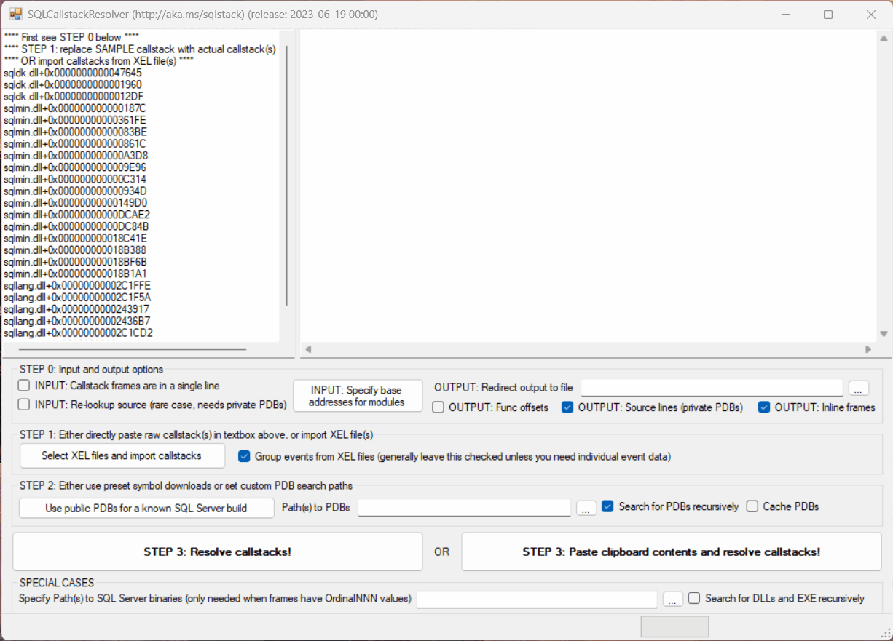
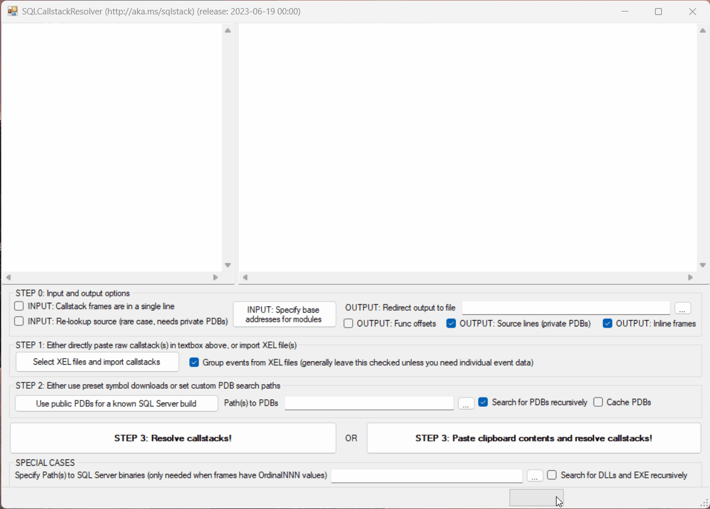

[](https://github.com/microsoft/SQLCallStackResolver/actions/workflows/build.yml)
[](https://github.com/microsoft/SQLCallStackResolver/actions/workflows/codeql-analyze.yml)
# Overview
SQLCallStackResolver is a sample tool provided for users who want to resolve the raw call stack information provided by Microsoft SQL Server, to a "symbolized" form with function names. This helps in self-service diagnostics of certain SQL Server issues. Please note that this sample tool is provided AS-IS - see [SUPPORT](SUPPORT.md) for details.

# Installation
Please refer to the [Releases](../../releases) section for a ready-to-run set of binaries. This sample tool does not have any other requirements other than .NET Framework 4.7.2 or above. SQLCallStackResolver requires Windows 10, Windows Server 2016, or higher. Other Microsoft components used, and their associated terms of use are documented in the [Building](./BUILDING.md) file.

# Usage
SQLCallStackResolver takes raw call stack text as input. These call stacks can be obtained from a variety of SQL Server sources:

* Individual call stack extracted from XML output from the XEvents DMVs or .XEL files. These represent individual call stack frames in the with `module+offset` notation
* Multiple call stacks in Histogram XML markup (multiple-instance case of above).
* Older format with just virtual addresses [[1]](#footnote1). This is typically what you would get when viewing a .XEL file (containing call stack events) using SQL Server Management Studio.
* `dll!OrdinalNNN` frames [[2]](#footnote2). This is a very rare case and typically an outcome of user error (for example, enabling a trace flag to symbolize call stacks, without having the required PDBs).
* Output from SQLDumper (SQLDumpNNNN.TXT file) - at least the sections which have stack frames [[5]](#footnote5)
* The new XML format provided by the `callstack_rva` action in SQL Server 2022 CTP 2.0 and above. [[example]](#usage-example-3)

To use the tool, follow the sequence shown on the GUI:
* Step 0 is usually not required for most cases. More details on the options are [[here]](#footnote1).
* Step 1 is where you can optionally import SQL Extended Events (XEL) files to populate the call stack input area on the left side of the tool.
* Step 2 is a needed one. In all cases you must provided a symbol search path [[3]](#footnote3),[[4]](#footnote4). If a symbol server is used in this path, there must be corresponding information in the input call stack to help identify which PDBs to get from the symbol server. See [[6]](#footnote6).
* Two buttons are provided for executing the (final) "Step 3" on the GUI:
    * The first button processes the input that was already manually entered (or pasted) into the call stack input area.
    * The second button copies the current contents of the clipboard, into the call stack input area on the tool. If you click this button, for privacy reasons you will be prompted to confirm that you indeed want to use the clipboard contents. You can optionally remember your choice for pasting clipboard content, in which case that choice is stored in a file called `user.config` under the `C:\Users\YOURUSERNAME\AppData\Local\Microsoft_Corporation\SQLCallStackResolver.exe_Url_STRONGNAME\VERSION` folder. If you want to reset the choice, you can delete the `user.config` file and restart the tool.

## Usage example #1
This is a simple case, where you enter the call stack in `module+offset` notation, and select one of the pre-populated list of SQL builds to download symbols. You then click the Resolve Callstacks button, and obtain the symbolized output in the right-hand side textbox.


## Usage example #2
This is a typical use case, where you can import events from a XEL file. Because the XEL file does not have the module base addresses, you have to first provide those module base addresses. You can then select one of the pre-populated list of SQL builds to download symbols and finally click the Resolve Callstacks button to obtain the symbolized output in the right-hand side textbox.


## Usage example #3
With SQL Server 2022 CTP 2.0 and above, call stacks returned by the XE functions are represented in a XML format, with PDB symbol information provided inline for each frame. With this format for call stacks, you can alternatively specify the symbol path as a symbol server, as documented in the [WinDbg help](https://docs.microsoft.com/en-us/windows-hardware/drivers/debugger/symbol-path#using-a-symbol-server). An example of this is shown below. Note the usage of the "Paste clipboard contents" button in this example.


## Notes on usage
1. <a name="footnote1"></a>In this case you need to populate the Base Addresses with the output of the following query from the actual SQL instance when the XE was captured:
```sql
select name, base_address from sys.dm_os_loaded_modules where name not like '%.rll'
```
2. <a name="footnote2"></a>When dealing with frames having `OrdinalNNN`, you need to press the Module Paths button where you will be prompted to enter the path to a folder containing the modules (typically, DLLs) involved. For example you can point to C:\Program Files\Microsoft SQL Server\MSSQL15.MSSQLSERVER\MSSQL\Binn for SQL 2019.
3. <a name="footnote3"></a>This has to be path to a folder or a set of such paths (can be UNC as well) each separated with a semicolon (;). Use the checkbox to specify if sub-folders need to be checked in each case. If multiple paths might contain matching PDBs, the first path from the left which contained the PDB wins. There is no means to know if the PDB is matched with the build that your are using - you need to ensure that the folder path(s) are correct!
4. <a name="footnote4"></a>To obtain public PDBs for major SQL releases, PowerShell scripts are available in the SQLCallStackResolver [Wiki](https://github.com/arvindshmicrosoft/SQLCallStackResolver/wiki/Obtaining-symbol-files-(.PDB)-for-SQL-Server-Releases)
5. <a name="footnote5"></a>The tool does not strip out just the 'Short Stack Dump' sections; instead it will preserve non-callstack text as-is.
6. <a name="footnote6"></a>It is possible to use a symbol server in the symbol search path. For example, the symbol search path can be specified as `srv*c:\syms*https://msdl.microsoft.com/download/symbols`. In such a case, the corresponding call stack input should have symbol metadata included in separate lines, each containing comma-separated values. Each of these lines should include the following minimum set of information:
    * Module name, for example `ntdll.dll`
    * PDB file name, for example `ntdll.pdb`
    * PDB GUID, for example `1EB9FACB-04C7-3C5D-EA71-60764CD333D0`
    * The very last comma-separated field will be taken as the PDB Age.

    Alternatively, this information can be provided as XML <frame> elements, with each `frame` element having attributes called `module`, `pdb`, `guid`, and `age` which fully describe the matching PDB information for that frame. This is the format which was introduced first in SQL Server 2022 CTP 2.0. When symbol metadata is included (in either CSV or XML format), it is parsed and used to retrieve PDBs from the symbol server specified. If matching PDBs are not found locally for whatever reason (wrong paths, wrong metadata, failed download etc.), the symbol resolution step will just return back the original raw input.

# Contributing
This project welcomes contributions and suggestions. Most contributions require you to agree to a Contributor License Agreement (CLA) declaring that you have the right to, and actually do, grant us the rights to use your contribution. For details, visit https://cla.opensource.microsoft.com. When you submit a pull request, a CLA bot will automatically determine whether you need to provide a CLA and decorate the PR appropriately (e.g., status check, comment). Simply follow the instructions provided by the bot. You will only need to do this once across all repos using our CLA. For technical instructions on how to build and test this project, see [Building](./BUILDING.md).

This project has adopted the [Microsoft Open Source Code of Conduct](https://opensource.microsoft.com/codeofconduct/). For more information see the [Code of Conduct FAQ](https://opensource.microsoft.com/codeofconduct/faq/) or
contact [opencode@microsoft.com](mailto:opencode@microsoft.com) with any additional questions or comments.

# Trademarks
This project may contain trademarks or logos for projects, products, or services. Authorized use of Microsoft trademarks or logos is subject to and must follow [Microsoft's Trademark & Brand Guidelines](https://www.microsoft.com/en-us/legal/intellectualproperty/trademarks/usage/general). Use of Microsoft trademarks or logos in modified versions of this project must not cause confusion or imply Microsoft sponsorship. Any use of third-party trademarks or logos are subject to those third-party's policies.
