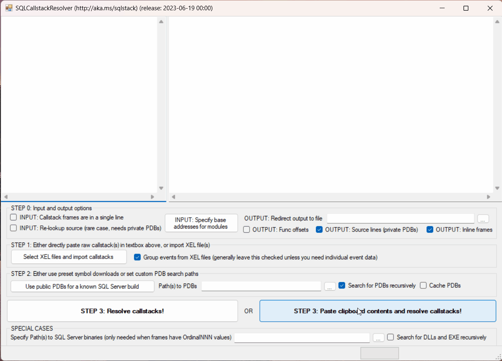

[](https://github.com/microsoft/SQLCallStackResolver/actions/workflows/build.yml)
[](https://github.com/microsoft/SQLCallStackResolver/actions/workflows/codeql-analyze.yml)
# Overview
SQLCallStackResolver is a sample tool provided for users who want to resolve the raw call stack information provided by Microsoft SQL Server, to a "symbolized" form with function names. This helps in self-service diagnostics of certain SQL Server issues. Please note that this sample tool is provided AS-IS - see [SUPPORT](SUPPORT.md) for details.

# Installation
Please refer to the [Releases](../../releases) section for a ready-to-run set of binaries. Release 2.0 is self-contained, XCOPY / UnZip and run - no external installation required other than .NET Framework 4.7.2 or above. We now include the [msdia140.dll](https://blogs.msdn.microsoft.com/calvin_hsia/2016/07/30/whats-in-a-pdb-file-use-the-debug-interface-access-sdk/) and [XELite](https://www.nuget.org/packages/Microsoft.SqlServer.XEvent.XELite/) as part of the ZIP file with the rest of the binaries. Note that SQLCallStackResolver 2.0 is released as purely for 64-bit the Intel/AMD family (x64) Windows OS. Windows 10 or Windows Server 2016 are the minimum required OS versions. SQLCallStackResolver uses registration-free COM activation of msdia140.dll, so no additional configuration is needed.

Other Microsoft components used, and their associated terms of use are documented in the [Building](#building) section.

# Usage
SQLCallStackResolver takes callstacks as input. These callstacks can be obtained from a variety of SQL Server sources:

* Individual callstack extracted from XML output from the XEvents DMVs or .XEL files. These represent individual call stack frames in the with `module+offset` notation
* Multiple callstacks in Histogram XML markup (multiple-instance case of above).
* Older format with just virtual addresses [[1]](#footnote1). This is typically what you would get when viewing a .XEL file (containing callstack events) using SQL Server Management Studio.
* `dll!OrdinalNNN` frames [[2]](#footnote2). This is a very rare case and typically an outcome of operator error (enabling a trace flag to symbolize call stacks but forgot to use PDBs).
* Output from SQLDumper (SQLDumpNNNN.TXT file) - at least the sections which have stack frames [[5]](#footnote5)
* The new XML callstack format which is available in SQL Server 2022 CTP 2.0 and above. [[example]](#usage-example-3)

The tool comes with a pre-populated example in the textboxes, just follow that example with your real-world stack(s). In all cases you must provided a symbol search path [[3]](#footnote3),[[4]](#footnote4). If a symbol server is used in this path, there must be corresponding information in the input callstack to help identify which PDBs to get from the symbol server. See [[6]](#footnote6).

## Usage example #1
This is a trivial case, where the user enters the callstack in `module+offset` notation, and selects one of the pre-populated list of SQL builds to download symbols. The user then clicks the Resolve Callstacks button, and obtains the symbolized output in the right-hand side textbox.


## Usage example #2
This is a typical use case, where the user imports events from a XEL file. Because the XEL file does not have the module base addresses, the user first inputs those. They then select one of the pre-populated list of SQL builds to download symbols and finally click the Resolve Callstacks button to obtain the symbolized output in the right-hand side textbox.


## Usage example #3
With SQL Server 2022 CTP 2.0 and above, callstacks returned by the XE functions are represented in a XML format, with PDB symbol information provided inline for each frame. With this format for callstacks, you can alternatively specify the symbol path as a symbol server, as documented in the [WinDbg help](https://docs.microsoft.com/en-us/windows-hardware/drivers/debugger/symbol-path#using-a-symbol-server). An example of this is shown below.



## Contributing

This project welcomes contributions and suggestions.  Most contributions require you to agree to a Contributor License Agreement (CLA) declaring that you have the right to, and actually do, grant us the rights to use your contribution. For details, visit https://cla.opensource.microsoft.com.

When you submit a pull request, a CLA bot will automatically determine whether you need to provide a CLA and decorate the PR appropriately (e.g., status check, comment). Simply follow the instructions provided by the bot. You will only need to do this once across all repos using our CLA.

## Building
* You will need Visual Studio 2022+ installed to build this solution.
* Access to NuGet is needed to fetch and restore package dependencies.
* If needed, you may also need to manually obtain the current versions of the following files:
    * symsrv.dll and dbghelp.dll (from the x64 / AMD64 Windows Debugger package, part of Windows SDK and many other tools) are used under the terms published [here](https://docs.microsoft.com/en-us/legal/windows-sdk/redist#debugging-tools-for-windows).
    * msdia140.dll and msdia140.dll.manifest are components of Visual Studio 2022 used under the terms as published [here](https://docs.microsoft.com/en-us/visualstudio/releases/2022/redistribution).
* Tests are implemented using [MSTest v2](https://docs.microsoft.com/en-us/visualstudio/test/mstest-update-to-mstestv2?view=vs-2022#why-upgrade-to-mstestv2). Please try to ensure that tests are passing before submitting a PR.
* Prior to running tests, you need to execute the [downloadsyms.ps1](./Tests/TestCases/downloadsyms.ps1) file once as shown below:
``` cmd
cd .\SQLCallStackResolver\Tests\TestCases
powershell < .\downloadsyms.ps1
```
  Monitor for any warnings shown by the script and address them if needed.

* When a PR is submitted, there is a GitHub Actions workflow which will build the project and run tests. PRs cannot merge till the workflow succeeds.

# Notes
1. <a name="footnote1"></a>In this case you need to populate the Base Addresses with the output of the following query from the actual SQL instance when the XE was captured:
``` sql
select name, base_address from sys.dm_os_loaded_modules where name not like '%.rll'
```
2. <a name="footnote2"></a>When dealing with frames having `OrdinalNNN`, you need to press the Module Paths button where you will be prompted to enter the path to a folder containing the modules (typically, DLLs) involved. For example you can point to C:\Program Files\Microsoft SQL Server\MSSQL15.MSSQLSERVER\MSSQL\Binn for SQL 2019.
3. <a name="footnote3"></a>This has to be path to a folder or a set of such paths (can be UNC as well) each separated with a semicolon (;). Use the checkbox to specify if sub-folders need to be checked in each case. If multiple paths might contain matching PDBs, the first path from the left which contained the PDB wins. There is no means to know if the PDB is matched with the build that your are using - you need to ensure that the folder path(s) are correct!
4. <a name="footnote4"></a>To obtain public PDBs for major SQL releases, PowerShell scripts are available in the SQLCallStackResolver [Wiki](https://github.com/arvindshmicrosoft/SQLCallStackResolver/wiki/Obtaining-symbol-files-(.PDB)-for-SQL-Server-Releases)
5. <a name="footnote5"></a>The tool does not strip out just the 'Short Stack Dump' sections; instead it will preserve non-callstack text as-is.
6. <a name="footnote6"></a>It is possible to use a symbol server in the symbol search path. For example, the symbol search path can be specified as `srv*c:\syms*https://msdl.microsoft.com/download/symbols`. In such a case, the corresponding callstack input should have a minimal set of details included in separate lines, each containing comma-separated values. Each of these lines should include the following minimum set of information:
* Module name, for example `ntdll.dll`
* PDB file name, for example `ntdll.pdb`
* PDB GUID, for example `1EB9FACB-04C7-3C5D-EA71-60764CD333D0`
* The very last comma-separated field will be taken as the PDB Age.

    Alternatively, this information can be provided as XML <frame> elements, with each `frame` element having attributes called `module`, `pdb`, `guid`, and `age` which fully describe the matching PDB information for that frame. This is the format which was introduced first in SQL Server 2022 CTP 2.0.

    When such information is included (in either CSV or XML format), it is parsed and used to retrieve PDBs from the symbol server specified. If matching PDBs are not found locally for whatever reason (wrong paths, wrong metadata, failed download etc.), the symbol resolution step will just return back the original raw input.

This project has adopted the [Microsoft Open Source Code of Conduct](https://opensource.microsoft.com/codeofconduct/).
For more information see the [Code of Conduct FAQ](https://opensource.microsoft.com/codeofconduct/faq/) or
contact [opencode@microsoft.com](mailto:opencode@microsoft.com) with any additional questions or comments.

## Trademarks

This project may contain trademarks or logos for projects, products, or services. Authorized use of Microsoft trademarks or logos is subject to and must follow [Microsoft's Trademark & Brand Guidelines](https://www.microsoft.com/en-us/legal/intellectualproperty/trademarks/usage/general). Use of Microsoft trademarks or logos in modified versions of this project must not cause confusion or imply Microsoft sponsorship. Any use of third-party trademarks or logos are subject to those third-party's policies.
